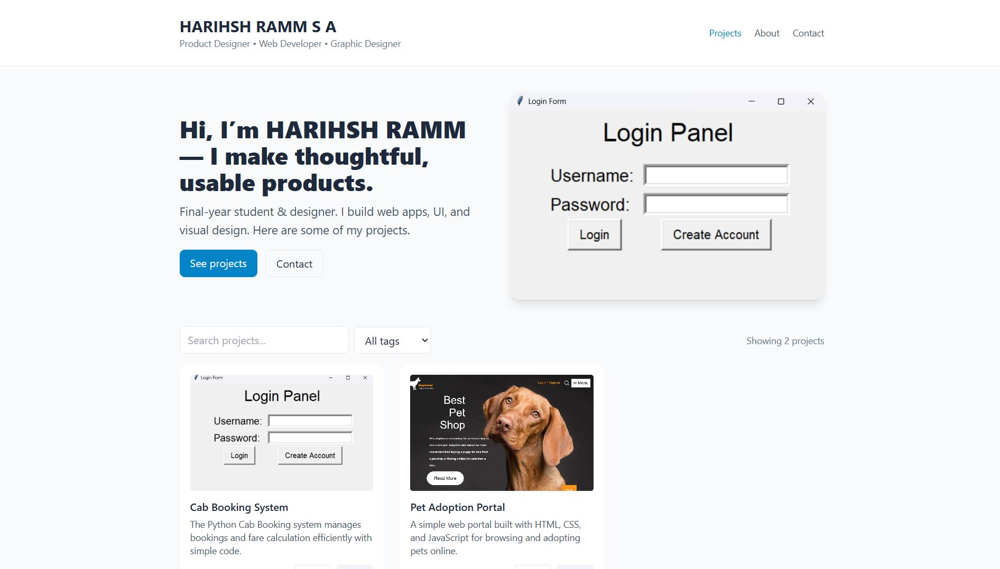
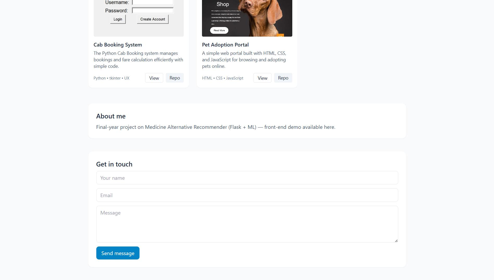

# 📁 Interactive-Portfolio  
🔗 **Live Demo:** https://happiestsad.github.io/Interactive-Portfolio/

A lightweight, static portfolio and projects gallery designed to be easy to edit and deploy to GitHub Pages. 🚀

## ✨ Features

- 🔍 Filterable project gallery  
- 🖼️ Project modal with screenshots and links  
- 📬 Contact form (static demo)  
- 📄 Single-page, no build step (Tailwind CDN + vanilla JS)  

## ⚙️ How to use

1. Fork / clone this repo.  
2. Edit `projects.json` to add/update your projects.  
3. Replace images in `assets/`.  
4. Push to GitHub.  

### 🚀 Deploy to GitHub Pages

- Go to repository → Settings → Pages → Branch: `main` → folder: `/(root)` → Save.  
- Or use the `gh-pages` branch approach (not required for this simple static site).  

## 📜 License

MIT © HARIHSH RAMM S A

## Screenshots

  
  

